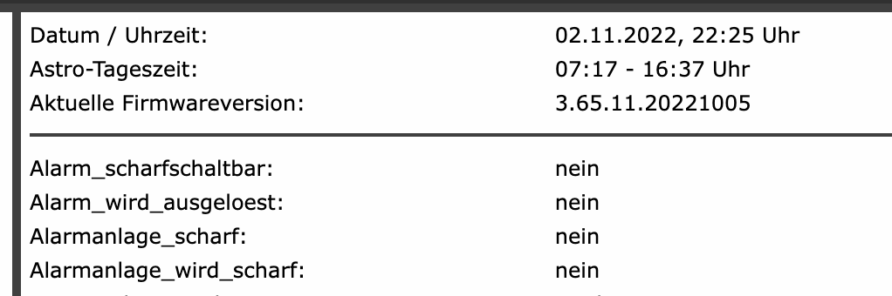

# CCUstomize

- Was es macht:
  - **Entfernen der "gerade/ungerade"-Einfärbung** von Systemvariablen auf der Startseite 
  - **Austausch des Favicons und des Logos**
  - **Hinzufügen eines Menüpunkts "Systemsteuerung"** mit den fixen Elementen aus "Einstellungen->Systemsteuerung" 
  - **Entfernen der MenüButtons** "CloudMatic" und "Mediola" aus der Systemsteuerung
  - **Ändern** von `paired="true"` auf `paired="false"` in den **BidCos XML Files**, damit Verknüpfungen zu Tastern nicht immer paarweise angelegt werden
  - **Anlegen eines Symlinks** aus `/usr/local/addons/redmatic/bin/ffmpeg /usr/local/addons/ffmpeg` nach `/usr/local/addons/ffmpeg`
  - **Entfernen der Abfrage "Backup erstellen" und "Lizenz akzeptieren"** beim Durchführen eines automatischen FW-Updates 
  - **Entfernen der Vorbelegung `WriteLine("Hallo Welt");`** beim Öffnen des Skripteditors 
  - **Automatisches Schließen des "OK"-Popups** nach dem Übertragen von Konfigurationsdaten an ein Gerät
  - **Anpassen der Filterung nach Regex-Ausdrücken**
  - **Anpassungen der Spaltenbreiten im Systemprotokoll**
  

- *Ordner `redmatic-homekit` enthält Anpassungen für Homebrew Geräte (1x manuell kopieren nach `/usr/local/addons/`, ist dann im CCU Backup mit enthalten)*
- *Ordner `unused` enthält Patche, die ich nicht (mehr) benötige, aber noch nicht wegwerfen möchte*
